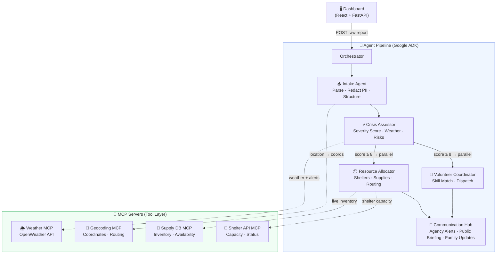

<div align="center">


<br/><br/>

<h1>🛡️ SafeHaven</h1>
<h3>AI-Powered Disaster Response Coordination</h3>
<p>
  Five specialized AI agents — built on Google ADK + Gemini 2.0 Flash — <br/>
  coordinate search & rescue, resource allocation, volunteer dispatch, <br/>
  and public communications in real time during a disaster event.
</p>

<br/>

[**🚀 Live Demo**](https://safehaven.onrender.com) · [**📋 Kaggle Submission**](https://kaggle.com/competitions/agents-for-good) · [**🎬 YouTube Demo**](#) · [**📖 Full Spec (PID.md)**](./PID.md)

<br/>

</div>

---

## 🎯 What is SafeHaven?

When a disaster strikes, coordination fails — agencies don't talk, resources go to the wrong place, families don't know where to go. **SafeHaven** fixes that.

Submit a raw disaster report in plain English. In seconds, a pipeline of 5 coordinated AI agents:

1. **Parses and redacts PII** from the report
2. **Scores crisis severity** using live weather and secondary risk data
3. **Allocates nearest shelters and supplies** based on real capacity data
4. **Dispatches volunteers** matched by skill and proximity
5. **Broadcasts public alerts**, family notifications, and agency briefings

All coordinated. All automated. All traceable.

---

## 🏗️ Architecture



---

## ✨ Features

<table>
<tr>
<td width="50%">

### 🤖 Multi-Agent Pipeline
- **5 specialized agents** — each with its own prompt, tools, and responsibility
- **Parallel execution** — Resource Allocator + Volunteer Coordinator run simultaneously for critical incidents (severity ≥ 8)
- **Real Gemini 2.0 Flash** — no mocked LLM responses
- **Full audit trail** — every agent action logged to `state/audit.jsonl`

</td>
<td width="50%">

### 🛡️ Privacy-First Design
- **PII redaction** built into the Intake Agent — names, addresses, and contact details never leave the secure pipeline
- **Encrypted family notifications** via vault tokens
- **GDPR-aligned volunteer data** — only skill hashes stored, no identifiable info exposed

</td>
</tr>
<tr>
<td width="50%">

### 📊 Live Command Dashboard
- **7-page React dashboard** — Command Center, Incident Map, Resources, Volunteers, Communications, Audit Log
- **Real-time updates** — all data auto-refreshes every 5–10s
- **Interactive Leaflet map** — incident pins, severity colors, shelter circles
- **Notification bell** with live incident feed

</td>
<td width="50%">

### 🔌 4 MCP Servers
- **Weather MCP** — OpenWeatherMap API, alerts, forecast
- **Geocoding MCP** — address → lat/lon, routing distance
- **Supply DB MCP** — real-time inventory across 12 shelters
- **Shelter API MCP** — live capacity, occupancy, amenities

</td>
</tr>
</table>

---

## 🚀 Quick Start

### Prerequisites

- Python 3.11+
- Node.js 18+
- A free [Gemini API key](https://aistudio.google.com)

### 1. Clone & install

```bash
git clone https://github.com/Sharique-shaikh-git/safehaven.git
cd safehaven

# Python backend
python -m venv .venv
.venv\Scripts\activate          # Windows
# source .venv/bin/activate     # macOS/Linux
pip install -r requirements.txt

# React frontend
cd dashboard/frontend
npm install --legacy-peer-deps
cd ../..
```

### 2. Configure environment

```bash
cp .env.example .env
```

Open `.env` and fill in your keys:

```env
GEMINI_API_KEY=AIza...          # Required — get free at aistudio.google.com
OPENWEATHER_API_KEY=...         # Optional — for live weather in Crisis Assessor
GOOGLE_MAPS_API_KEY=...         # Optional — for precise geocoding
```

### 3. Run

Open **two terminals**:

```bash
# Terminal 1 — FastAPI backend
.venv\Scripts\activate
uvicorn dashboard.api:app --reload --port 8000
```

```bash
# Terminal 2 — React frontend
cd dashboard/frontend
npm run dev
```

Visit **http://localhost:5173** 🎉

---

## 🐳 Docker

Build and run everything in a single container:

```bash
docker build -t safehaven .
docker run -p 8000:8000 \
  -e GEMINI_API_KEY=AIza... \
  -e OPENWEATHER_API_KEY=... \
  safehaven
```

Visit **http://localhost:8000**

The multi-stage build (Node 20 → Python 3.13 slim) produces a ~350MB image.

---

## 📂 Project Structure

```
safehaven/
├── agents/
│   ├── orchestrator.py          # Pipeline coordinator
│   ├── intake_agent/            # Parse + redact PII
│   ├── crisis_assessor/         # Severity scoring + weather
│   ├── resource_allocator/      # Shelters + supply allocation
│   ├── volunteer_coordinator/   # Skill-match + dispatch
│   └── communication_hub/       # Alerts + public briefing
│
├── mcp_servers/
│   ├── weather_mcp/             # OpenWeatherMap
│   ├── geocoding_mcp/           # Address → coordinates
│   ├── supply_db_mcp/           # Inventory data
│   └── shelter_api_mcp/         # Shelter capacity
│
├── dashboard/
│   ├── api.py                   # FastAPI — 7 endpoints
│   ├── mock_data.py             # Seed data (12 shelters, 20 volunteers)
│   └── frontend/                # React 18 + Vite 5
│       └── src/components/      # 12 components, 7 pages
│
├── security/                    # PII redaction, encryption, audit
├── skills/                      # Geo parser, weather skills
├── Dockerfile                   # Multi-stage build
└── state/                       # Runtime: incidents.jsonl, audit.jsonl
```

---

## 🧠 The 5 Agents

| Agent | Role | Tools |
|---|---|---|
| **Intake Agent** | Parse raw report → structured incident object, redact all PII | Geocoding MCP |
| **Crisis Assessor** | Score severity 1–10, identify secondary risks, check live weather | Weather MCP |
| **Resource Allocator** | Find nearest shelter, reserve capacity, allocate supplies | Supply DB MCP, Shelter API MCP |
| **Volunteer Coordinator** | Match required skills → available volunteers, dispatch tasks | Shelter API MCP |
| **Communication Hub** | Send family notifications, volunteer alerts, agency reports, public briefing | All channels |

---

## 🔄 Example Pipeline Run

**Input:**
```
Hurricane Mara — 4 families (including elderly residents) trapped on 
rooftop in Bayport. Rising water. Immediate rescue needed.
```

**Pipeline output (truncated):**
```json
{
  "severity_score": 9,
  "parallel_branch_triggered": true,
  "shelter_assigned": "Riverside Medical Center",
  "volunteers_dispatched": ["V-SRT-001", "V-SRT-002", "V-MED-003"],
  "total_notifications_sent": 10,
  "public_briefing": "PUBLIC ADVISORY: Emergency operations underway in Bayport...",
  "agency_report_summary": "Critical Hurricane Mara incident — 4 families, rescue underway"
}
```

**Time to complete:** ~12 seconds with Gemini 2.0 Flash

---

## 🛠️ Tech Stack

| Layer | Technology |
|---|---|
| **AI Framework** | Google Agent Development Kit (ADK) |
| **LLM** | Gemini 2.0 Flash |
| **Tool Protocol** | Model Context Protocol (MCP) |
| **Backend** | FastAPI + Uvicorn |
| **Frontend** | React 18 + Vite 5 |
| **Map** | Leaflet.js |
| **Containerization** | Docker (multi-stage) |
| **Data** | JSONL append-only logs |

---

## 📜 License

MIT — see [LICENSE](./LICENSE)

---

<div align="center">

Built for the **[Kaggle Agents for Good Hackathon 2026](https://kaggle.com/competitions/agents-for-good)**

**Powered by Google ADK · Gemini 2.0 Flash · 5 Agents · 4 MCP Servers**

</div>
